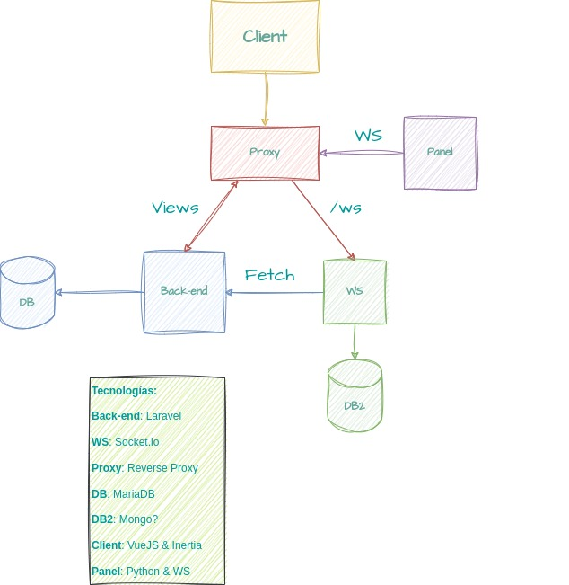

# SolarPanelApp

Aplicación de automatización de un panel solar con motores, que utiliza inteligencia artificial para orientarse hacia el sol y ser lo más eficiente posible.

## Integrantes del equipo

**Sergio Parejo** -> Servidor WebSocket, Base de datos con Mongo

**Adrián García** -> API Rest con laravel

**Raul Guerrero** -> Diseño y parte del maquetado

**Miguel García del Real Ortiz** -> Servidor de Placa Solar y parte del maquetado

### Esquema de la Estructura del proyecto

### Instalación del proyecto de laravel para su desarrollo

> Necesitamos tener instalado composer de manera local en nuestra máquina

Usar `composer install` dentro de la carpeta back-end para obtener todas las dependencias del proyecto, tras esto descargamos el paquete breeze de laravel con `composer require laravel/breeze`, instalamos con artisan el paquete usando `php artisan breeze:install vue` y con esto ya podemos o arrancar la máquina de docker o usar php artisan serve para arrancar un servidor de desarrollo.

La máquina de docker es muy completa, tiene una aplicación de laravel expuesta en el puerto 8000, una base de datos MariaDB y también consta con PHPMyAdmin en el puerto 8001 para poder administrar la base de datos en el proceso de desarrollo. Instalando las dependencias como he explicado antes y haciendo un `docker-compose up` debería de funcionar perfectamente todo.

> Importante: En linux, a la carpeta que crea el contenedor de la base de datos para la persistencia hay que darle permisos. Comando: `chmod -R 0777 data/`

### Consejos para el desarrollo en laravel

Podemos sacar provecho del Hot Module Replacement de VueJS arrancando 2 servidores, 1 de laravel, con `php artisan serve` y otro de node con `npm run dev` de esta manera todo cambio que realicemos en los archivos de Vue se veran al instante en el navegador.

Si esto no es posible, es necesario correr `npm run build` para compilar los archivos de Vue a Javascript y asi poder servirlos

### Servidor [WebSocket](https://python-socketio.readthedocs.io/en/latest/client.html#installation) en Python

Para utilizar la librería recomiendo usar un [venv](https://docs.python.org/3/library/venv.html) (virtual environment) esto es como crear un 'node_modules' pero para las dependencias de python, para que así se nos instale en el proyecto y en el ordenador.

Para instalar la librería de socket.io, hay que ejecutar el comando `pip install "python-socketio[client]"`, con esto ya podremos importarlo en nuestro código y usarlo.

> Importante: Para que funcione el cliente de Python, es necesario que el servidor tenga configurado un namespace, si no lo tiene no es capaz de realizar al conexión.
