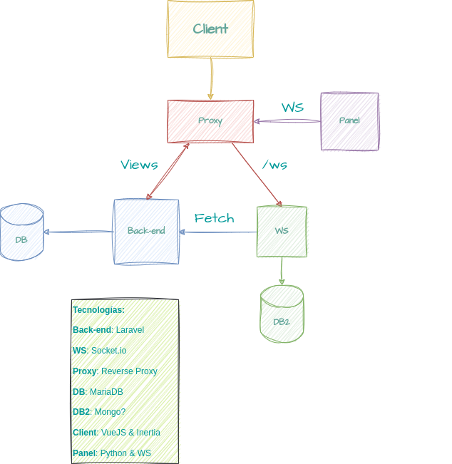

# SolarPanelApp

Aplicación de automatización de un panel solar con motores, que utiliza inteligencia artificial para orientarse hacia el sol y ser lo más eficiente posible.

## Integrantes del equipo

**Sergio Parejo** -> Servidor WebSocket, Base de datos con Mongo

**Adrián García** -> API Rest con laravel

**Raul Guerrero** -> Diseño y parte del maquetado

**Miguel García del Real Ortiz** -> Servidor de Placa Solar y parte del maquetado

### Esquema de la Estructura del proyecto

### Instalación del proyecto para su desarrollo

> Necesitamos tener instalado composer de manera local en nuestra máquina

Usar `composer install` dentro de la carpeta back-end para obtener todas las dependencias del proyecto, tras esto descargamos el paquete breeze de laravel con `composer require laravel/breeze`, instalamos con artisan el paquete usando `php artisan breeze:install vue` y con esto ya podemos o arrancar la máquina de docker o usar php artisan serve para arrancar un servidor de desarrollo.

### Consejos para el desarrollo 

Podemos sacar provecho del Hot Module Replacement de VueJS arrancando 2 servidores, 1 de laravel, con `php artisan serve` y otro de node con `npm run dev` de esta manera todo cambio que realicemos en los archivos de Vue se veran al instante en el navegador.

Si esto no es posible, es necesario correr `npm run build` para compilar los archivos de Vue a Javascript y asi poder servirlos