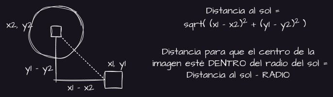

# Panel Solar

Esta carpeta contiene el código del panel solar.

Consta de 2 clases, la clase "ServerPanel", encargada de inicializar el panel solar, la conexión con el servidor principal y la utilización de la 2ª clase, "Sol", encargada del bucle principal del panel, de manejar el modo automático, y realizar los cálculos necesarios para el funcionamiento de esta.

## Funcionamiento del servidor

Una vez se arranque el servidor, hay 2 modos, el manual y el automático, por defecto arrancará con modo automático, y este permitirá a la placa arrancar su bucle en el que cada 3 minutos, hará una foto del cielo, pasará dicha foto a una inteligencia artificial que nos devolverá las coordenadas concretas del sol, y ejecutará los comandos necesarios para que el centro de la foto esté dentro de el radio del sol. 

En el modo manual, al ser un servidor hecho con WebSockets podremos traspasar información de manera rápida y en tiempo real, por lo que el usuario administrador podrá controlar la placa solar a mano desde una interfaz, al ejecutar comandos manuales la placa automáticamente apagará el modo automático, y tras 5 minutos sin recibir comandos manuales, volverá a activar este.

> Tras la ejecución de cada comando, ya sea manual o automático, este mandará un mensaje al servidor principal, el cual almacenará tanto las fotos, respuestas de la IA y comandos ejecutados en forma de logs en un JSON y Dumpeará diariamente en una base de datos con MySQL cada día.

## Diagrama de Flujo
Hemos realizado el diagrama de flujo, en el que está el bucle principal del programa tanto del Servidor como del Seguidor solar.

Todo esto irá corriendo por detrás, pero una vez el servidor este conectado también estará escuchando por detrás todos los mensajes y habrá eventos concretos que ejecutarán funciones de la clase Sol, por lo que teniendo eso encuenta, TODOS los comandos, alteraran la variable de la clase Sol AUTO, esta variable indica el modo de funcionamiento de la placa, y si está a FALSE todo el programa automático se dormirá durante 5 minutos mientras el usuario haga cambios, tras 5 minutos se despertará y volverá al flujo normal del programa.

## Librerías utilizadas para el funcionamiento de la placa solar

[CV2](https://pypi.org/project/opencv-python/) -> Inteligencia artificial para el reconocimiento de Círculos.  
[Socket.io](https://pypi.org/project/Flask-SocketIO/) -> Librería de WebSockets para la conexión cliente/servidor en tiempo real.
[dotenv](https://pypi.org/project/python-dotenv/) -> Librería para leer variables de un archivo de configuración